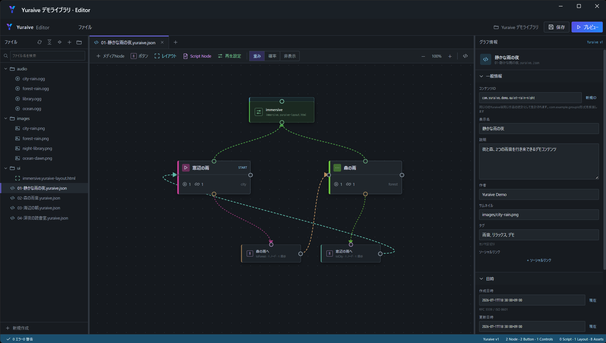
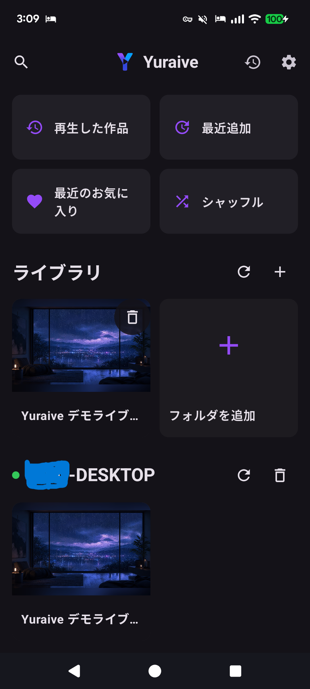
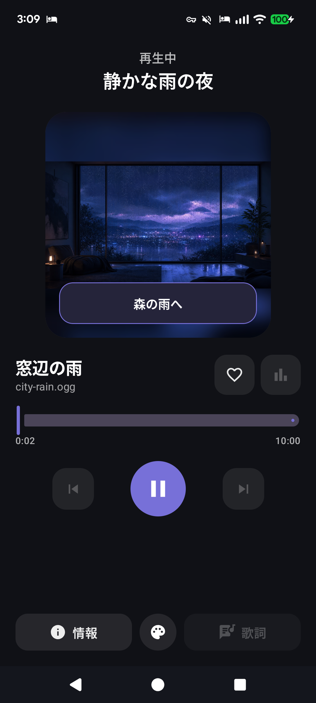
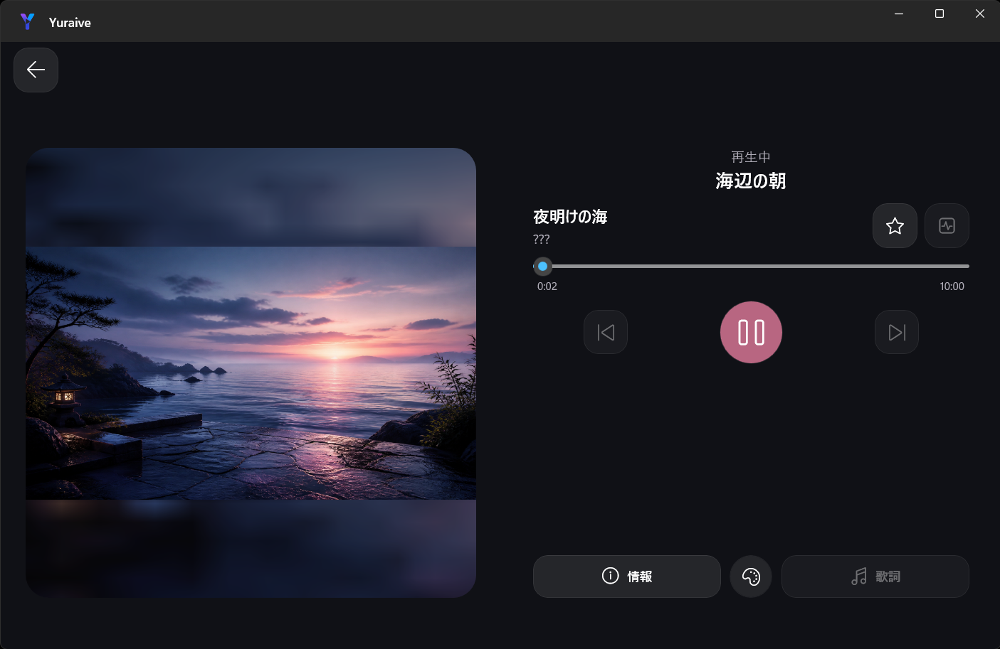

  

# Yuraive

Yuraiveは、音声や画像を組み合わせた分岐コンテンツを作成・再生できるメディアプレイヤーです。メディアやボタンをつないで作品の流れを組み立て、再生状況やユーザーの選択に応じて次のシーンへ自然に移行できます。

[公式サイト](https://yuraive.com) / [Yuraive Editor](https://editor.yuraive.com)

## ダウンロード

- Android — 準備中
- Windows — 準備中

## 主な機能

- ローカルフォルダー、SMB、WebDAVのコンテンツをライブラリへ追加
- Yuraive形式の作品と音声・画像を再生
- ボタン操作や再生終了によるシーン分岐
- 作品ごとのアートワーク、説明、タグを表示
- 再生履歴、お気に入り、シャッフル
- グラフ形式のビジュアルエディター
- カスタムレイアウトとStarlarkスクリプトに対応
- Android版からAndroid版へ接続

## スクリーンショット

  

  
  
  

## ディレクトリ

- `website` — **公式サイト**
- `editor` — **ビジュアルエディター**
- `player-android` — **Androidプレイヤー**
- `player-windows` — **Windowsプレイヤー**
- `runtime` — **共通ランタイム**
- `connect` — **プレイヤー接続サービス**

## 開発

開発環境とタスクは [`mise.toml`](./mise.toml) を参照してください。

## 開発計画

Android版はストア公開に必要なテスター数が揃っていません。iOS版は開発用ハードウェアが不足しているため、現在は開発できません。

上記以外の機能リクエストやプルリクエストを歓迎します。
